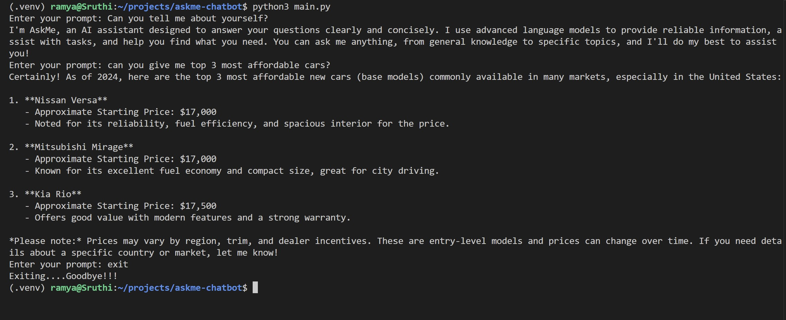

# AskMe

An AI-powered CLI assistant that answers your questions in a clear and concise way. Have a real back-and-forth conversation directly in your terminal.

## Features

- Conversational back-and-forth chat in the terminal
- Streaming responses for a smooth, real-time experience
- Customizable assistant personality via system prompt
- Graceful error handling for network, auth, and rate limit issues
- Handles empty input gracefully
- Clean exit with the `exit` command

## Tech Stack

- Python 3.12
- OpenAI API (gpt-4.1)
- python-dotenv

## Prerequisites

- Python 3.12+
- An OpenAI API key from [platform.openai.com](https://platform.openai.com/api-keys)

## Installation

1. Clone the repo
```bash
   git clone https://github.com/Sruthi-Pedakolimi/askme-chatbot.git
   cd askme-chatbot
```

2. Create and activate virtual environment
```bash
   python3 -m venv .venv
   source .venv/bin/activate
```

3. Install dependencies
```bash
   pip install openai python-dotenv
```

4. Create a `.env` file in the project root
```dotenv
   OPEN_API_KEY="your api key"
   OPENAI_BASE_URL="https://api.openai.com/v1"
   SYSTEM_PROMPT="You are AskMe assistant where the user will ask you any question and you should give answers in a clear and concise way"
```

## Usage

```bash
python3 main.py
```

Type your question and hit enter. Type `exit` to quit.

## Output
